# Exam 1 Lab: ARP Poisoning

**Author:** Sonny Ngo

This lab demonstrates an ARP poisoning (ARP spoofing) attack against two victim machines on the same local network, using Bettercap on the attacker machine, with Wireshark used to observe the resulting traffic.

## Environment

- **Attacker VM** — runs Bettercap and Wireshark
- **Victim A VM**
- **Victim B VM**

All three machines are assigned static IP addresses in the same subnet so they can communicate over the local network.

## Steps

### 1. Configure static IP addresses

Static IP addresses/subnets were set for the Attacker, Victim A, and Victim B virtual machines. Each system is assigned a unique IP address within the same subnet, allowing them to communicate over the local network.

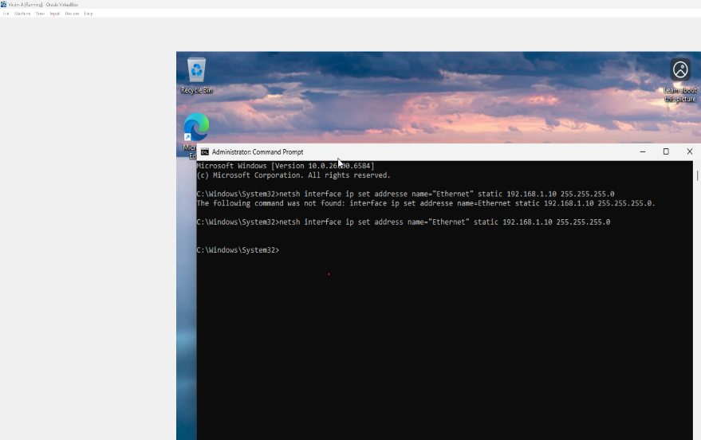
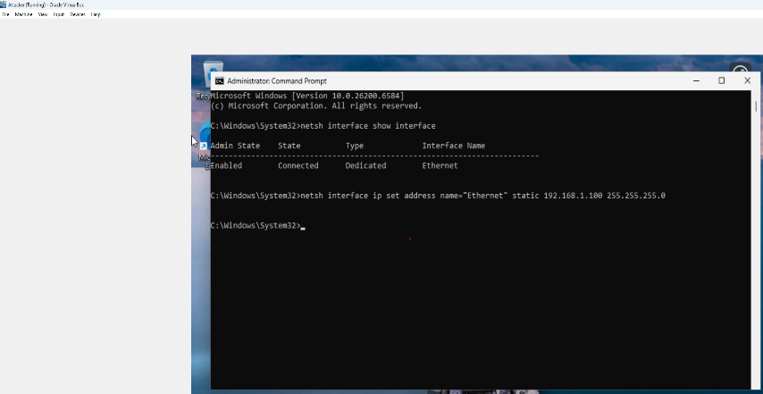
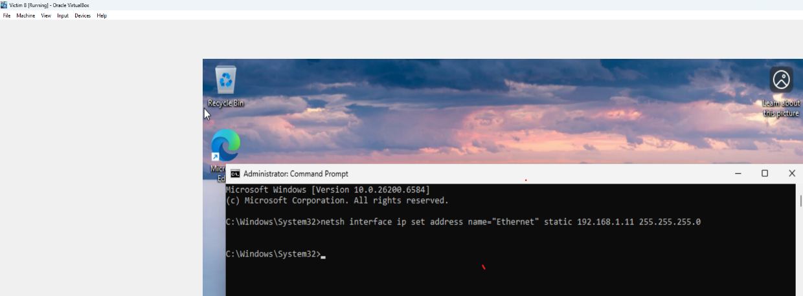

### 2. Test connectivity: Victim A → Victim B

Pinging Victim B from Victim A initially timed out. The firewall was disabled with:

```
netsh advfirewall set allprofiles state off
```

After disabling the firewall, the ping was retried and succeeded.

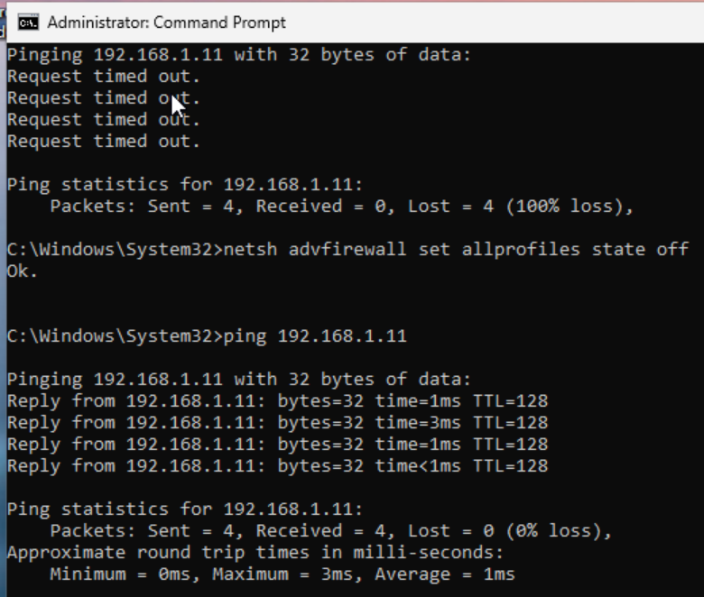

### 3. Test connectivity: Victim B → Victim A

Pinging Victim A from Victim B was successful:

```
ping 192.168.1.10
```

This confirms ICMP communication between Victim A and Victim B is working correctly, prior to the attack.

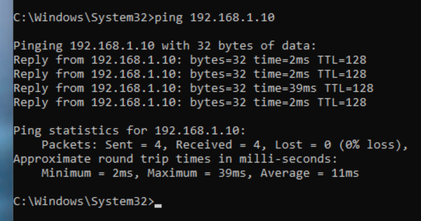

### 4. Record the ARP table before the attack

Running `arp -a` on Victim A and Victim B shows each IP address correctly mapped to its legitimate MAC address — normal network behavior before any attack.

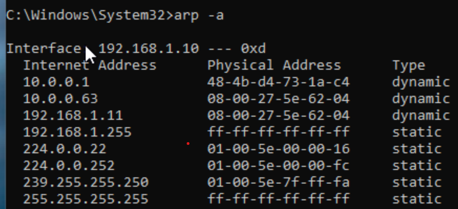
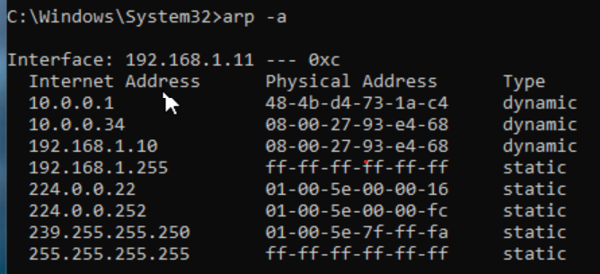

### 5. Start capturing traffic on the attacker

Wireshark was started on the attacker machine, capturing on the active adapter and filtering on `arp`, before the ARP poisoning attack begins.

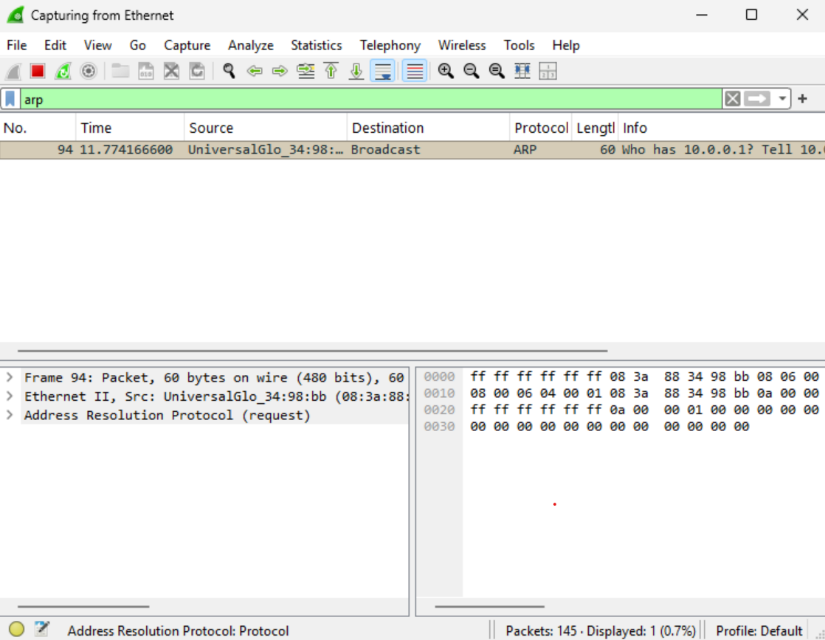

### 6. Launch Bettercap

On the Attacker VM, Bettercap was launched from an administrator command prompt:

```
bettercap.exe -iface Ethernet
```

> Note: Ettercap does not have a build that supports Windows 11, so Bettercap is used as an alternative.

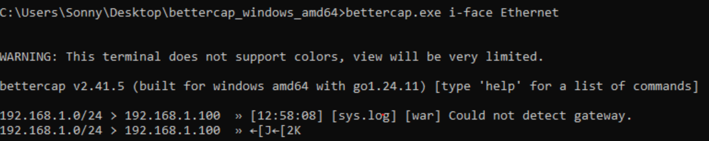

### 7. Probe the network

```
net.probe on
```

Waited about 10 seconds for hosts to be discovered.

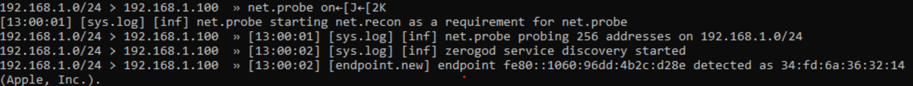

### 8. List discovered hosts

```
net.show
```


Bettercap discovers the active hosts on the network, including Victim A and Victim B.

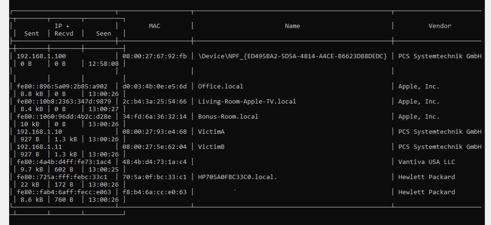

### 9. Start the ARP spoofing attack

```
set arp.spoof.targets 192.168.1.10,192.168.1.11
arp.spoof on
```

This begins sending forged ARP replies to both victims.

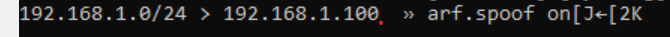
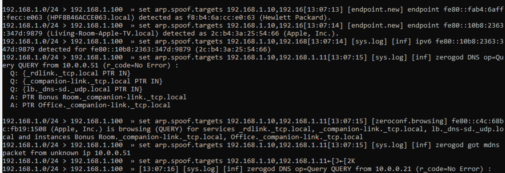

### 10. Confirm the poisoned ARP tables

Running `arp -a` again on Victim A and Victim B shows the Attacker's MAC address (192.168.1.11) has replaced the legitimate MAC addresses for the other host — confirming the ARP poisoning succeeded.

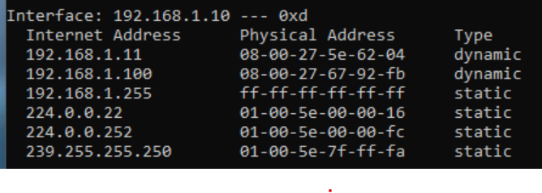
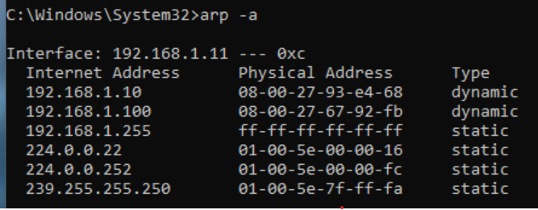

### 11. Observe intercepted traffic

With the attacker positioned as a man-in-the-middle, ICMP traffic between the two victims can now be observed passing through the attacker.

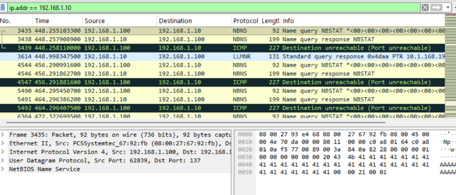
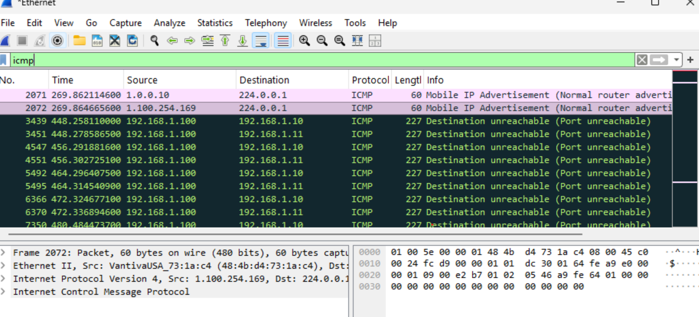

Initial traffic flowing in Wireshark:

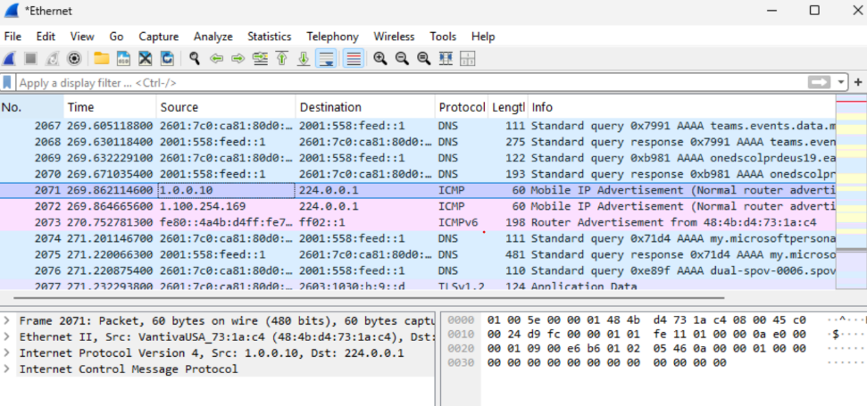

### 12. Clean up

The ARP cache was cleared on the victim machines, restoring normal network operation after the attack.

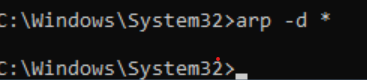

## Mitigation

ARP poisoning can be mitigated using:

- **Static ARP entries** — prevent the OS from trusting unsolicited ARP replies
- **Dynamic ARP Inspection (DAI)** — validates ARP packets on managed switches
- **Encrypted communication protocols** (e.g., HTTPS) — limit what an attacker positioned as a man-in-the-middle can actually read
- **Network segmentation** and **intrusion detection systems** — reduce the blast radius and help flag spoofing attempts
